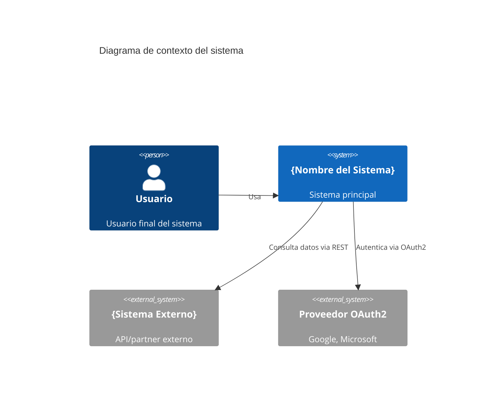
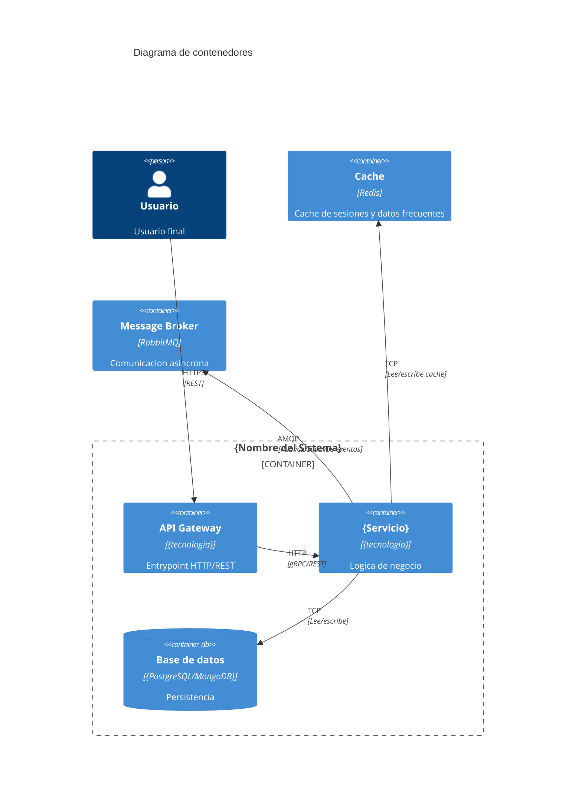

# Plantilla: Architecture.md

> Fase: Inception > Track B — Bootstrapping Tecnico > Arquitectura (via architect)
> Artefacto: `docs/architecture.md`

---

# Arquitectura del Sistema: {Nombre del Proyecto}

> Ultima actualizacion: {fecha}
> Version: 1.0

## 1. Proposito y alcance

Descripcion breve del sistema: que problema resuelve, para quien, y cual es su alcance.

- **Nombre del sistema**: {nombre}
- **Proposito**: {que hace el sistema}
- **Usuarios**: {quienes lo usan}
- **Alcance**: {que cubre y que no}

---

## 2. Diagrama de contexto (C4 — Nivel 1)

---

## 3. Diagrama de contenedores (C4 — Nivel 2)

---

## 4. Topologia de servicios

| Servicio | Responsabilidad | Lenguaje/Framework | Puertos | Dependencias |
|----------|----------------|--------------------|---------|-------------|
| {Nombre} | {que hace} | {stack} | {puertos} | {BD, cache, otros servicios} |

### Mapa de comunicacion

| Origen | Destino | Protocolo | Proposito |
|--------|---------|-----------|-----------|
| API Gateway | {Servicio A} | REST / gRPC | Consultas y comandos |
| {Servicio A} | {Servicio B} | Async (eventos) | Notificar cambio de estado |

---

## 5. Stack tecnologico

| Capa | Tecnologia | Version | Justificacion | Skill |
|------|-----------|---------|---------------|-------|
| Runtime | {.NET, Node.js, Python, Go, Java, Rust} | {version} | {razon} | `{lenguaje}-{framework}` |
| Framework | {ASP.NET Core, Express, FastAPI, Chi, Spring Boot, Axum} | {version} | {razon} | `{lenguaje}-{framework}` |
| Base de datos | {PostgreSQL, SQL Server, MongoDB} | {version} | {razon} | — |
| ORM | {EF Core, Prisma, SQLAlchemy, sqlc, JPA, sqlx} | {version} | {razon} | — |
| Cache | Redis | 7.x | Alto rendimiento | — |
| Message broker | {RabbitMQ, Kafka, SQS, Azure Service Bus} | {version} | {razon} | — |
| Container runtime | Docker | latest | Portabilidad | — |
| Orquestacion | {Kubernetes, ECS, Cloud Run} | — | {razon} | — |
| CI/CD | {GitHub Actions, GitLab CI, Azure DevOps} | — | Integrado con repo | `git-flow` |
| Testing unitario | {xUnit + Moq, Jest, pytest, testing/testify, JUnit + Mockito, cargo test} | {version} | {razon} | `tdd-{lenguaje}` |
| BDD | {Reqnroll, Cucumber.js, Behave} | {version} | {razon} | `bdd-{lenguaje}` |
| Observabilidad | OpenTelemetry + {Jaeger/Zipkin} + Prometheus + Grafana | — | Estandar CNCF | — |

---

## 6. ADR — Architecture Decision Records

### ADR-001: Patron arquitectonico

**Estado**: Aceptado
**Fecha**: {fecha}
**Contexto**: Se necesita definir el patron arquitectonico para organizar el codigo del microservicio.

**Opciones consideradas**:
1. Clean Architecture (capas: Domain, Application, Infrastructure, API)
2. Vertical Slices (feature folders con toda la logica junta)
3. Arquitectura Hexagonal (Ports & Adapters)

**Decision**: Se elige {Clean Architecture / Vertical Slices / Hexagonal}.

**Consecuencias**:
- Positivas: {lista}
- Negativas: {lista}

---

### ADR-002: Estrategia de comunicacion entre servicios

**Estado**: Aceptado
**Fecha**: {fecha}
**Contexto**: Varios bounded contexts necesitan comunicarse entre si.

**Opciones consideradas**:
1. Solo sincrono (REST/gRPC)
2. Solo asincrono (eventos via message broker)
3. Hibrido: sincrono para consultas, asincrono para comandos

**Decision**: {opcion elegida}.

**Consecuencias**:
- Positivas: {lista}
- Negativas: {lista}

---

## 7. Patrones transversales

### Autenticacion y autorizacion
- Protocolo: {OAuth2, OpenID Connect, JWT}
- Proveedor: {interno, Auth0, Azure AD, Keycloak}
- Roles y permisos: {RBAC, ABAC, PBAC}

### Comunicacion entre servicios
- Sincrona: {REST, gRPC}
- Asincrona: {eventos via RabbitMQ/Kafka}
- Resiliencia: {Circuit Breaker, Retry con backoff, Timeout}

### Manejo de errores
- Formato: Problem Details (RFC 7807) o equivalente
- Errores de dominio: Result/Error pattern (no excepciones para flujo)
- Errores de infraestructura: Excepciones con middleware global

### Logging y observabilidad
- Logging: Estructurado (JSON), correlation ID en headers
- Tracing: OpenTelemetry con propagacion de contexto
- Metrics: Prometheus exposition format
- Health checks: `/health` (liveness), `/health/ready` (readiness)

### Estrategia de testing
- Unitarias: TDD con {framework} + mocking
- Integracion: TestContainers para dependencias reales
- Contract: Consumer-driven contract tests
- Cobertura minima: 80% dominio, 70% aplicacion

---

## 8. Restricciones tecnicas

- {restriccion 1}
- {restriccion 2}
- {restriccion de compliance}
- {restriccion de infraestructura}

---

## 9. Roadmap arquitectonico

| Version | Cambio arquitectonico | Justificacion | Fecha prevista |
|---------|----------------------|---------------|----------------|
| 1.0 | Arquitectura inicial (monolito modular / microservicio unico) | MVP | {fecha} |
| 1.1 | Extraer bounded context {X} a microservicio propio | Escalabilidad, equipo dedicado | {fecha} |
| 2.0 | Migrar a Event Sourcing en {bounded context} | Auditoria, trazabilidad | {fecha} |
